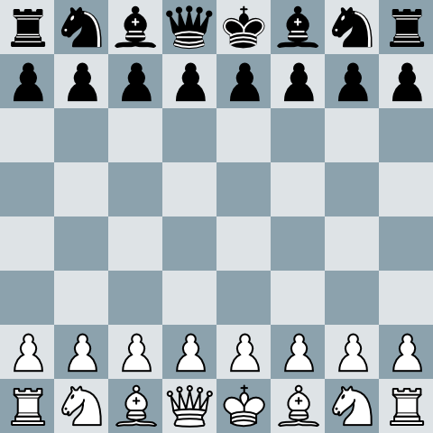

# fen2image

fen2image is a command-line tool that generates chess board png images from [FEN](https://en.wikipedia.org/wiki/Forsyth%E2%80%93Edwards_Notation) description.

With an input like:

    rnbqkbnr/pppppppp/8/8/8/8/PPPPPPPP/RNBQKBNR w KQkq - 0 1

It generates this board:

## Usage

	$ ./fen2image -fen "rnbqkbnr/pppppppp/8/8/8/8/PPPPP1PP/RNBQKBNR w KQkq - 0 1"

Other command line options are detailled in the help:

	$ ./fen2image --help

## Features

 - Generate image file out of a FEN string
 - Support for png and jpg output file formats
 - handle reversed board (view from blacks point of view)

## Todo

A lot of things remain to do.

board

 - write tests
 x convert board fromFEN
 x validate FEN input expression with regex

options
 - handle different cell size (-> resize icons)
 - cell colors
 X revert board
 X draw column names
renderer
 X PNG/JPG Renderer
 - SVG Renderer ?
 - better error handling

Fen validation
 - Making a perfect FEN validation is a [lot work](http://chess.stackexchange.com/questions/1482/how-to-know-when-a-fen-position-is-legal). It might not be necessary (FEN may represent illegal positions).

## Requirements

You need to have [Go](https://golang.org/doc/install) installed

## Installation

Once Go is installed, you can download and build the package:

	$ go get -u github.com/keirua/fen2image
	$ make build

## Contributing

Open issues, fork the repo, then make PR !

## Testing

Tests are pretty light right now, but that should be 

## Credits

The icons come from [WikiMedia](https://commons.wikimedia.org/wiki/Category:PNG_chess_pieces/Standard_transparent)

## Author

Made with love by [clemkeirua](https://twitter.com/clemkeirua) from [KeiruaProd](https://www.keiruaprod.fr)

## License

It's [MIT](LICENSE)